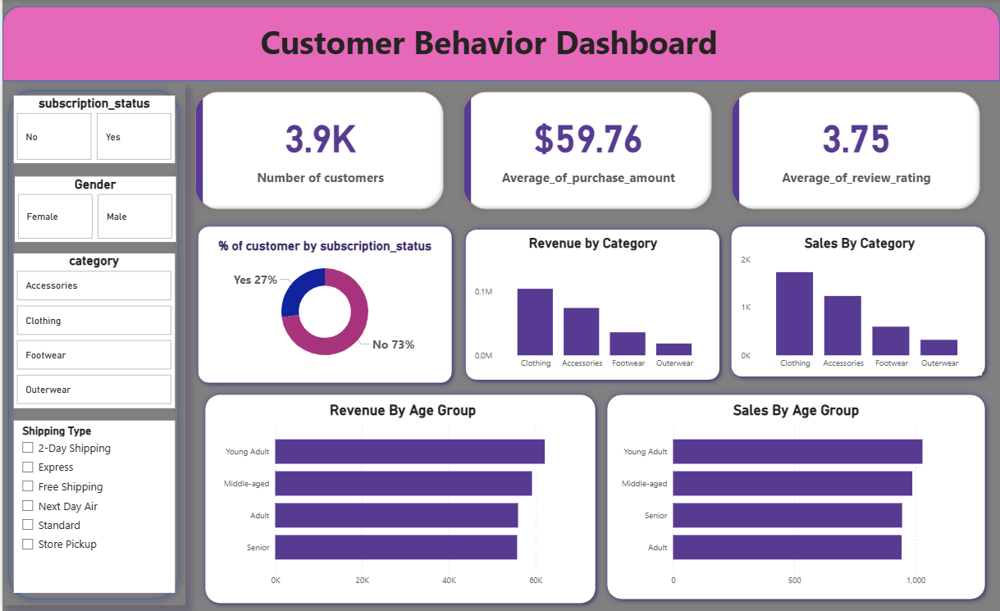

# customer_behaviour_analysis

 ## Data Analytics Project
📌 Project Overview

This project demonstrates an end-to-end data analytics workflow starting from raw data processing to business insights visualization.
The project involves loading a dataset in Python, performing Exploratory Data Analysis (EDA), cleaning and preparing the data, running SQL queries on PostgreSQL and SQL Server, and building an interactive Power BI dashboard.

The final insights are documented through a detailed analytical report and a presentation (PPT) for clear communication of results.

The main objective of this project is to analyze the dataset, uncover patterns, and generate meaningful insights that can support data-driven decision making.

 ## Dataset

The dataset used in this project contains structured information that allows analysis of trends, patterns, and relationships between variables.

Dataset Includes

Multiple columns containing categorical and numerical values

Records representing real-world observations

Data used to analyze trends, patterns, and performance indicators

## Dashboard Preview

## Dashboard Preview

Source

Dataset obtained from open data sources for analytics practice.

## Tools & Technologies Used
## Programming & Analysis

Python

Pandas

NumPy

Matplotlib

Seaborn

## Database

PostgreSQL

SQL Server

## Data Visualization

Power BI

## Other Tools

Jupyter Notebook

Git & GitHub

Microsoft PowerPoint

⚙️ Project Workflow
1️⃣ Data Loading

The dataset was imported into Python using Pandas for analysis.

## Tasks performed:

Reading dataset

Inspecting structure

Checking column types

Understanding dataset size

2️⃣ Exploratory Data Analysis (EDA)

EDA was performed to understand the dataset and discover patterns.

Key activities:

Descriptive statistics

Distribution analysis

Correlation analysis

Identifying missing values

Detecting outliers

Visualization techniques used:

Histograms

Bar charts

Box plots

Heatmaps

3️⃣ Data Cleaning

Data cleaning was performed to improve data quality.

Steps included:

Handling missing values

Removing duplicates

Correcting inconsistent data

Converting data types

Feature formatting

4️⃣ SQL Analysis

After cleaning the dataset, it was stored in PostgreSQL and SQL Server.

Various SQL queries were written to extract insights such as:

Aggregations (SUM, AVG, COUNT)

Filtering and grouping

Joins

Window functions

Business performance queries

SQL helped perform deeper analysis on structured data.

5️⃣ Power BI Dashboard

An interactive dashboard was created using Power BI to visualize insights.

Dashboard Features

KPI indicators

Interactive filters

Trend analysis

Category comparisons

Performance metrics

The dashboard helps users explore insights dynamically.

## Dashboard Preview

(Insert screenshots of your Power BI dashboard here)

Example visuals:

Sales trends

Customer behavior analysis

Category performance

## KPI metrics

## Key Insights / Results

Some of the insights discovered during analysis include:

Identification of key trends in the dataset

High performing categories or segments

Patterns in user/customer behavior

Important correlations between variables

These insights can help businesses make better strategic decisions.

## Project Deliverables

This project includes the following deliverables:

Python Notebook for Data Analysis

Cleaned Dataset

SQL Query Scripts

Power BI Dashboard File

Analytical Report

PowerPoint Presentation
